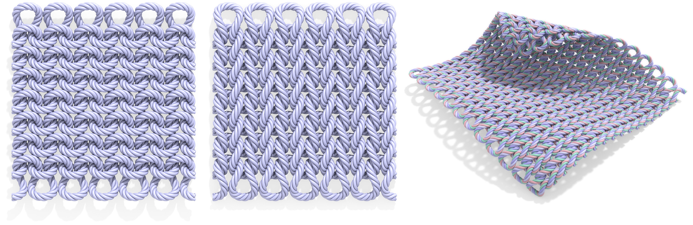
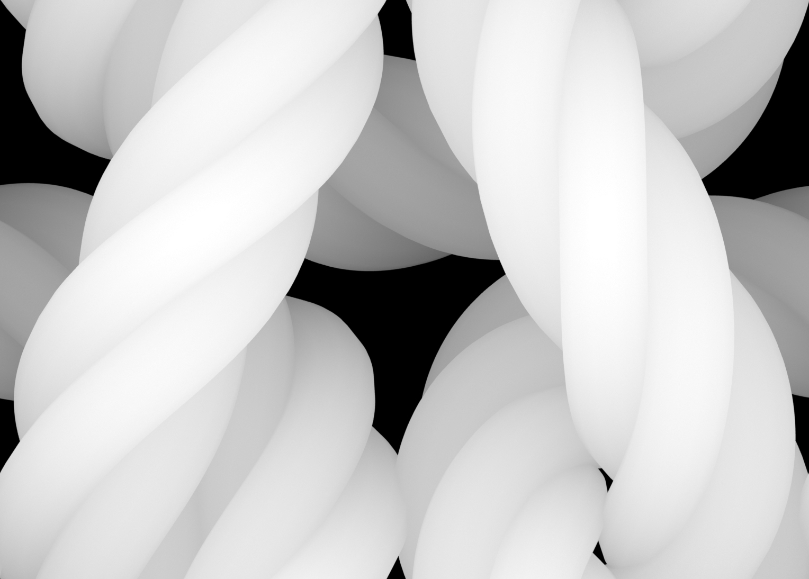
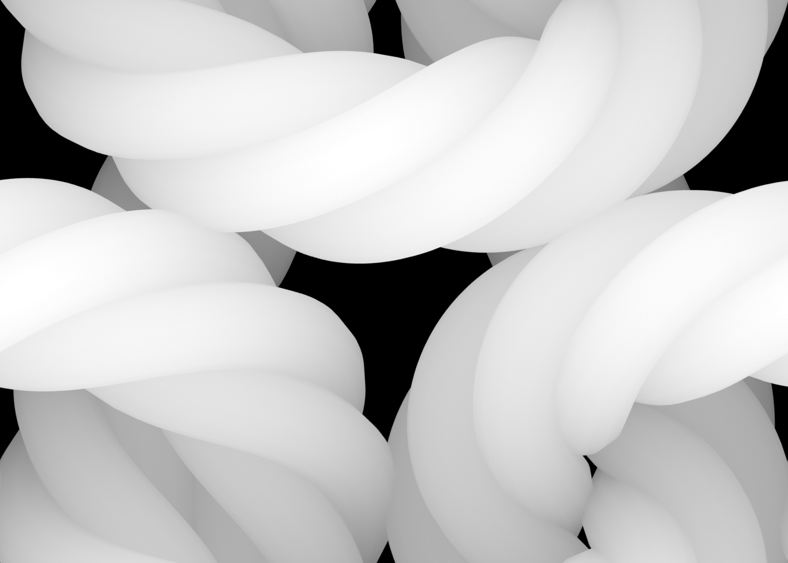
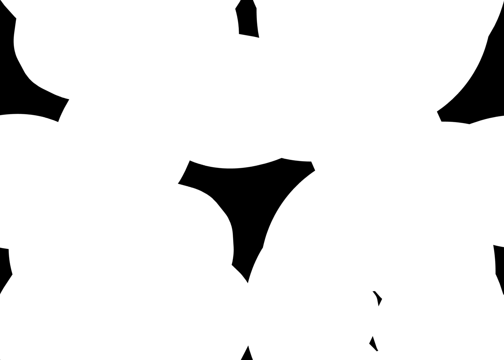

# plain-knit-yarn

A simple parametric model of plain-knit yarn curves, with C code and other resources.



## Overview

This repository provides code implementing closed-form expressions for smooth curves resembling a plain-knit stitch, suitable for appearance modeling and previsualization.  A unique feature of this model is that it also describes the twisted yarn fibers running along this stitch, making it suitable for modeling marled yarn. Adjustable parameters control the knit spacing, loop roundness, yarn thickness, and rate of fiber twisting.  Tileable displacement maps and code for generating curves are also provided.

## Media

- **Note.** The note [YarnCurve.pdf](YarnCurve.pdf) provides a more thorough description of the plain-knit curves, including a step-by-step derivation.  The [LaTeX](https://en.wikipedia.org/wiki/LaTeX) source files for this note can be found in the [note](note/) subdirectory.

- **Implementation.** The [code](code/) subdirectory contains a plain-C ([ANSI C90](https://en.wikipedia.org/wiki/ANSI_C)) implementation of the curve functions, as well as routines for writing curves to the [Wavefront OBJ](https://en.wikipedia.org/wiki/Wavefront_.obj_file) mesh file format.  This code should be easily portable to most other languages.  Several implementations have been developed, in a variety of packages:
    * [C](code/) — this repo
    * [Python](https://github.com/UH-AIM/yarn-fiber-generation) — by [Tim Chen](https://aim.me.uh.edu/about/), with visualization in [Grasshopper 3D](https://en.wikipedia.org/wiki/Grasshopper_3D)
    * [Julia](https://gist.github.com/empet/d7f0a03ef49151240c5a59882eda43e7) — by [empet](https://github.com/empet)
    * [WebGPU](https://potree.org/permanent/webgpu_playground/yarn/) — by [Markus Schütz](https://github.com/potree/potree/)
    * [C#/Grasshopper](https://discourse.mcneel.com/t/plain-knit-yarn-curves-from-keenan-crane/158186) — by [Laurent Delrieu](https://www.instagram.com/delrieulaurent/?hl=en)

<!-- * [Houdini](https://twitter.com/robpieke/status/1640805525494419456) -- by Rob Pieké -->

- **Displacement Maps.** For rendering knit materials, it can be more efficient (or simply more convenient) to use a displacement map rather than explicit curve geometry.  The images below provide tileable patterns for front and back displacements, as well as the associated alpha matte.  Higher bit-depth images can be found in the [displacement-maps](displacement-maps/) directory, in [OpenEXR](https://en.wikipedia.org/wiki/OpenEXR) and [Radiance HDR/RGBE](https://en.wikipedia.org/wiki/RGBE_image_format#:~:text=RGBE%20or%20Radiance%20HDR%20is,stores%20four%20bytes%20per%20pixel.) formats, which can help avoid shading artifacts.  These maps were generated by generating tube geometry around the curves, and rendering depth images via an orthographic projection (in [modo](https://www.foundry.com/products/modo)).

| front | back | alpha |
| ----- | -----| ------|
|  |  |  |

## License

<a rel="license" href="http://creativecommons.org/licenses/by/4.0/"></a><br /><span xmlns:dct="http://purl.org/dc/terms/" property="dct:title">A Simple Parametric Model of Plain-Knit Yarns</span> by <a xmlns:cc="http://creativecommons.org/ns#" href="http://www.cs.cmu.edu/~kmcrane/" property="cc:attributionName" rel="cc:attributionURL">Keenan Crane</a> is licensed under a <a rel="license" href="http://creativecommons.org/licenses/by/4.0/">Creative Commons Attribution 4.0 International License</a>.  Code is released under an [MIT License](LICENSE).

### BibTeX citation

```
@misc{Crane:2023:SPM,
title = {{A Simple Parametric Model of Plain-Knit Yarns}},
author = {Crane, Keenan},
month = {3},
year = {2023},
howpublished = {online},
url = {https://github.com/keenancrane/plain-knit-yarn},
}
```

